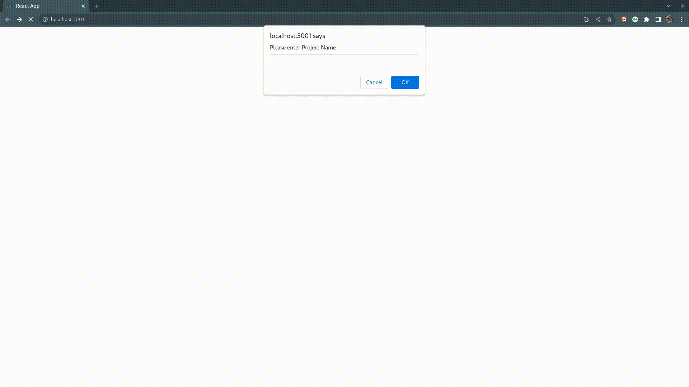

# Hi, I'm Abhishek Zade! 👋


# INFINITE BLACKBOARD 

This Propose of this project is to understand the maths behind the Infinte Board created using canvas.


## 🚀 About Me
I am a fresher looking for an SDE Role. I am a Google Summer of Code 2021 participant having skills in Web-Development, and Machine learning also worked on various projects such as MQTT servers using Flutter.


## 🛠 Skills
C++, Javascript, Python, Django, ML, GIT, SQL, DS & ALGORITHMS, ReactJs


## 🔗 Links
[](https://www.linkedin.com/in/arzade/)


## License

[MIT](https://choosealicense.com/licenses/mit/)


## Run Locally

Clone the project

Go to the project directory

```bash
  cd INFINITE-BOARD
```
```bash
   npm install
   npm start
```




